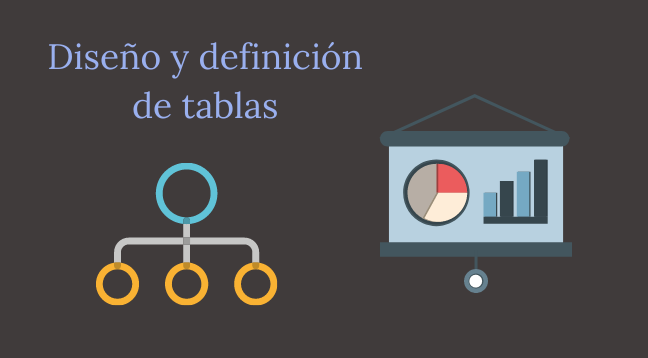

# *Diseño y definición de tablas*

## Objetivo
Al igual que hicimos con el armado de wireframes y bocetos antes de comenzar a
trabajar con HTML y CSS, siempre es recomendable que pensemos en las necesidades
de datos que va a tener nuestro sistema y que diseñemos la base de datos primero con
lápiz y papel (o su equivalente digital 🤓👌) antes de ponernos a crear tablas.
¡Vamos a ello!😎👍✨

## Clase 74

## Ubicación -> Programación/TRABAJOS PRACTICOS/Diseño y definición de tablas